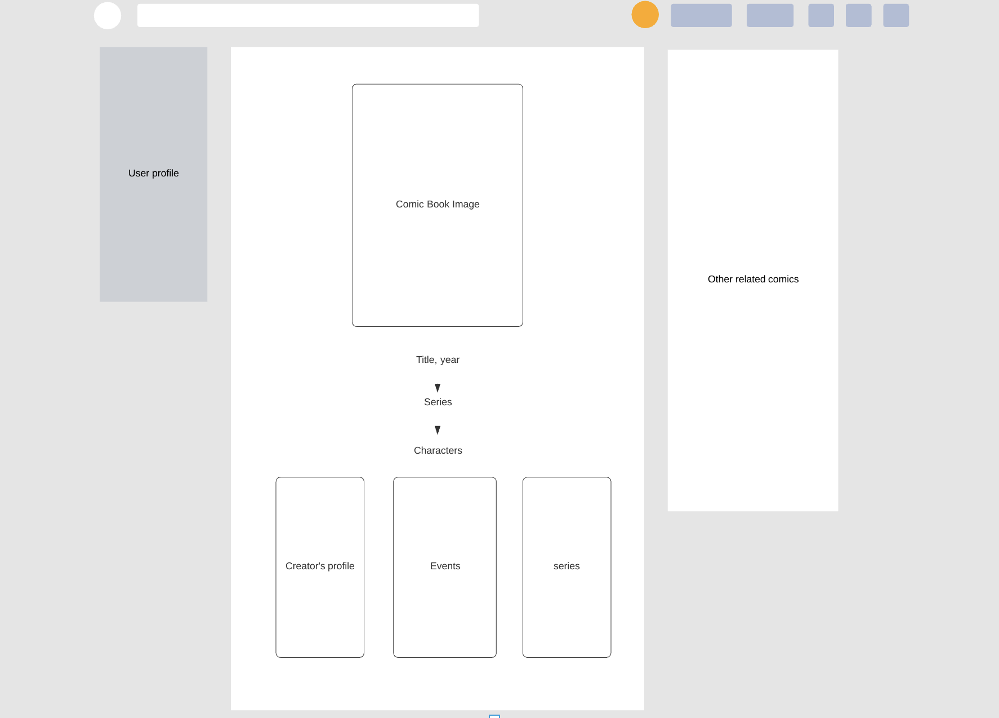
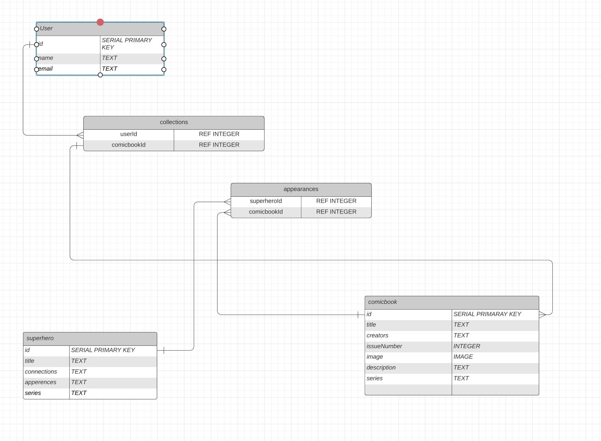

# Proposal

Requirements for the weekend

`1` An application name / concept:

--Comic Book Keeper is a database to 

`2` A repo for your project 2 (built from express_auth template):

--temporarily titled "mother_goose", based off the Auth template we created. Repo created.

`3` Wireframe for your app - (Lucidchart):

`4` An ERD with two models (minimum) > User + 1 Resource (one to many) - (Lucidchart)

`5` Create (3-5) User Stories for the base user experience - ( [Reference](https://revelry.co/resources/development/user-stories-that-dont-suck/) )

- ~~As a hiker I want to find good trails and so I can not waste my time inside on the computer~~

- ~~Since I have lots of ideas I would like a way to keep track of them so I can find them easy and turn them into a project.~~

- ~~I want to not have to decide what I want to wear and just have clothes picked for me based on the weather/time of day of my current location~~

- ~~I want to keep track of all the cool toys my son broke as he was growing up so I can show him what the value might have been over the years had he not broken them.~~

- ~~When there's lot of house projects to do I want to organize all the house project I said I was going to do and have not done and create a list that has reminders associated with them which would notify me I have to do that thing based on how long I have not looked at the reminder.~~

- ~~In the mornings when there a lot of people who use the pool I'd like to know if there was an open lane at the pool before I drive over to the gym, and I'd like to be able to reserve it by placing a HOLD on it which would expire after a set number of minutes.~~

-Since I have a large comic book collection, I'd like to be able to upload an image and some info on each book to a site, and find connections to other stories that the character would be in.

`6` Resource's Restful Routing table ( [Readme](https://romebell.gitbook.io/sei-412/node-express/00readme-1/01intro-to-express/00readme#restful-routing) )

`7` Find API and test to see if you can get data ( *be able to print data in the console using Axios, Node-Fetch, and/or Postman* )

I found these two APIs:
https://developer.marvel.com/docs#!/public/getCreatorCollection_get_12
https://superheroapi.com/index.html

Seems logical to connect the Marvel api to the superhero since that has a connection property. Could be interesting. 