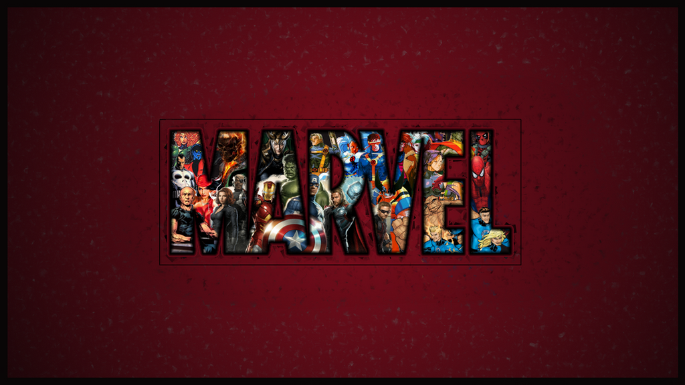

# Comic Book Finder

> User story: Since I have a large comic book collection and I love comics, I'd like to be able to search for a comicbook, and find details on the story. It would be nice to see these comicc, and find other issues I've never heard of.

The Marvel Universe is vast. There is a treasure trove of series that include characters we know, and ones we have not discovered yet. Many times issues get set aside and forgotten, or a series concludes long after we have moved on. Finding comics with a search feature could spark further interest in reading.

## HOW TO USE

A user can search their favorite comics, and find that comic in the Marvel database. They can see some info on the book, like characters, creator, events, and if it is part of a series. The main goal is to find info and save the comic in a user account. Search through the home page for comic book titles and a results page will display the query.

### HOME PAGE



On the home page, the search box queries Marvel's API and finds comics that match the search term. The list of comics that are returned display on a results page, and these images are clickable to show the title and a description of the comic.

Buttons on the page allow a user to add the comic to a favorites list. The user will need to be logged in to save and review the comics they liked.

## HOW IT WORKS

Marvel's api is robust and rich with lots of information. The details provided on search results include creators and year made, whether the comic is part of a series, and images associated with the result. I narrowed the focus to comic book titles, and honing the results page to show the comic book cover or the images stored in the image property for that search result.

To get connect to the Marvel Universe, the URL had to include the public API key, a time stamp, and a hash -- a combination of the public, private keys and time stamp. There's a few different ways to do this, and I choose the following:

```javascript
const publickey = process.env.PUBLIC_KEY;
const privatekey = process.env.PRIVATE_KEY;
const SECRET_SESSION = process.env.SECRET_SESSION;

app.get('/comics', (req, res) => {
    // console.log(req.url)
    const marvelUrl = `https://gateway.marvel.com/v1/public${req.url}`
    axios.get(marvelUrl, {
        params: {
            ts: ts,
            apikey: publickey,
            hash: hash,
        }
```

The search parameters were fine tuned to dig into the data containers Marvel set up.

```javascript
app.get('/comics', (req, res) => {
    const marvelUrl = `https://gateway.marvel.com/v1/public${req.url}`
    axios.get(marvelUrl, {
        params: {
            ts: ts,
            apikey: publickey,
            hash: hash,
        }
    }).then(response => {
        let data = response.data.data.results;
        let comicResults = [];
        
        for (let i = 0; i < data.length; i++) {
            const comicData = {};
            comicData.id = data[i].id;
            console.log(comicData.id);
            comicsImgs = data[i].thumbnail;
            comicData.comicImg = `${comicsImgs.path}.${comicsImgs.extension}`;
            comicResults.push(comicData);
        }
        res.render('comics', { 'data': comicResults });
    })
```

With the amount of information coming back, there is a lot to work with. The possibilities are wide for dispaying info, and relating results to other properties, like finding associated comics or characters connected to the comic book title. For comic book lovers, and those interested in Marvel characters, the data received through the API can be tailored to however I would like to show or relate information.

To install the app, fork and clone from the git repository. Sign up for a gree developer account with Marvel at https://developer.marvel.com. Install dependencies through `npm install` and run sequelize to migrate the databases.


## FUTURE CONSIDERATIONS

* The ability to search characters as well as comic titles through one search field.
* Display all comic books in the details page if the queried search is part of a series.
* Show character details, as well as comics in which they appear.
* Show comic book creators, and search further into other series the artist may have a connection.
* Create a community forum which users can rate and comment on past and present comics.